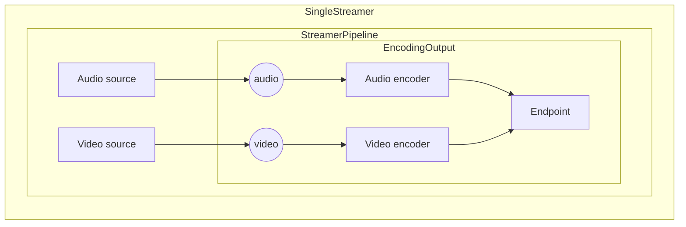

# Streamers

## Introduction

The `Streamer` is a class that streams audio and video from a source to an endpoint. It is
responsible for controlling the audio and video sources, encoders, and endpoint.

Multiple streamers are available depending on the number of independent outputs you want to
have:

- [`SingleStreamer`](https://thibaultbee.github.io/StreamPack/api/streampack-core/io.github.thibaultbee.streampack.core.streamers.single/-single-streamer/index.html): for a single output (example: live or record)
- [`DualStreamer`](https://thibaultbee.github.io/StreamPack/api/streampack-core/io.github.thibaultbee.streampack.core.streamers.dual/-dual-streamer/index.html): for 2 independent outputs (example: live stream and record)
- for multiple outputs, you can use the [`StreamerPipeline`](https://thibaultbee.github.io/StreamPack/api/streampack-core/io.github.thibaultbee.streampack.core.pipelines/-streamer-pipeline/index.html) class that allows to create more complex
  pipeline with multiple independent outputs (example: audio in one file, video in another file)

## Single streamers

The [`SingleStreamer`](https://thibaultbee.github.io/StreamPack/api/streampack-core/io.github.thibaultbee.streampack.core.streamers.single/-single-streamer/index.html) is a `Streamer` that streams to a single output.
The implementation is the [`SingleStreamer`](https://thibaultbee.github.io/StreamPack/api/streampack-core/io.github.thibaultbee.streampack.core.streamers.single/-single-streamer/index.html). Underneath, it is [`StreamerPipeline`](https://thibaultbee.github.io/StreamPack/api/streampack-core/io.github.thibaultbee.streampack.core.pipelines/-streamer-pipeline/index.html) with a single
`EncodingOutput`.

The single streamers data flow is as follows:



- [`AudioOnlySingleStreamer`](https://thibaultbee.github.io/StreamPack/api/streampack-core/io.github.thibaultbee.streampack.core.streamers.single/-audio-only-single-streamer/index.html): A streamer that streams from an audio source (microphone by default).
- [`VideoOnlySingleStreamer`](https://thibaultbee.github.io/StreamPack/api/streampack-core/io.github.thibaultbee.streampack.core.streamers.single/-video-only-single-streamer/index.html): A streamer that streams from a video source (microphone by default).
- [`cameraSingleStreamer`](https://thibaultbee.github.io/StreamPack/api/streampack-core/io.github.thibaultbee.streampack.core.streamers.single/camera-single-streamer.html): A factory to create a streamer with a camera source.
- [`videoMediaProjectionSingleStreamer`](https://thibaultbee.github.io/StreamPack/api/streampack-core/io.github.thibaultbee.streampack.core.streamers.single/video-media-projection-single-streamer.html): A factory to create a streamer with a media projection video
  source. You need to set activity result
- [`audioVideoMediaProjectionSingleStreamer`](https://thibaultbee.github.io/StreamPack/api/streampack-core/io.github.thibaultbee.streampack.core.streamers.single/audio-video-media-projection-single-streamer.html): A factory to create a streamer with a media projection
  video source and a media projection audio source. You need to set activity result

By default the `Streamer` endpoint is the [`DynamicEndpoint`](https://thibaultbee.github.io/StreamPack/api/streampack-core/io.github.thibaultbee.streampack.core.elements.endpoints/-dynamic-endpoint/index.html) which made the `Streamer` agnostic of
the protocol.
The [`DynamicEndpoint`](https://thibaultbee.github.io/StreamPack/api/streampack-core/io.github.thibaultbee.streampack.core.elements.endpoints/-dynamic-endpoint/index.html) infers from the [`MediaDescriptor`](https://thibaultbee.github.io/StreamPack/api/streampack-core/io.github.thibaultbee.streampack.core.configuration.mediadescriptor/-media-descriptor/index.html) object passed to the `Streamer` by `open` or
`startStream` methods.

## Dual streamers

The [`DualStreamer`](https://thibaultbee.github.io/StreamPack/api/streampack-core/io.github.thibaultbee.streampack.core.streamers.dual/-dual-streamer/index.html) is a `Streamer` that streams to 2 independent outputs.
The implementation is the [`DualStreamer`](https://thibaultbee.github.io/StreamPack/api/streampack-core/io.github.thibaultbee.streampack.core.streamers.dual/-dual-streamer/index.html). Underneath, it is [`StreamerPipeline`](https://thibaultbee.github.io/StreamPack/api/streampack-core/io.github.thibaultbee.streampack.core.pipelines/-streamer-pipeline/index.html) with 2
`EncodingOutput`.

## Streamer pipeline

The [`StreamerPipeline`](https://thibaultbee.github.io/StreamPack/api/streampack-core/io.github.thibaultbee.streampack.core.pipelines/-streamer-pipeline/index.html) offers a way to create a custom pipeline with multiple independent outputs.
Add an `EncodingOutput` to the pipeline with `createOutput` method.

There are currently no limitations on the number of outputs you can create but be careful with the
number of encoders you create. Each encoder will use CPU and memory resources.

```kotlin
// In this example, we create a streamer pipeline with 2 outputs: one for audio and one for video
val streamerPipeline = StreamerPipeline(context, withAudio = true, withVideo = true)

// Add sources
streamerPipeline.setAudioSource(MicrophoneSourceFactory())
streamerPipeline.setVideoSource(CameraSourceFactory())

// Add outputs
val audioOnlyOutput =
    streamerPipeline.createEncodingOutput(withVideo = false) as IConfigurableAudioEncodingPipelineOutput
val videoOnlyOutput =
    streamerPipeline.createEncodingOutput(withAudio = false) as IConfigurableVideoEncodingPipelineOutput

// Configure outputs
val audioConfig = AudioCodecConfig(mimeType = MediaFormat.MIMETYPE_AUDIO_OPUS)
val videoConfig = VideoCodecConfig(
    mimeType = MediaFormat.MIMETYPE_VIDEO_AVC,
    resolution = Size(VIDEO_WIDTH, VIDEO_HEIGHT)
)

audioOnlyOutput.setAudioCodecConfig(audioConfig)
videoOnlyOutput.setVideoCodecConfig(videoConfig)

// Run stream
val audioOnlyDescriptor = UriMediaDescriptor(FileUtils.createCacheFile("audio.ogg").toUri())
val videoOnlyDescriptor = UriMediaDescriptor(FileUtils.createCacheFile("video.mp4").toUri())
audioOnlyOutput.startStream(audioOnlyDescriptor)
videoOnlyOutput.startStream(videoOnlyDescriptor)
```
