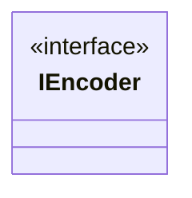

# 🗜️ Encoder Configuration

## On-the-fly control

The encoder object is accessible from the streamer object: `audioEncoder` and `videoEncoder`
directly as [`IEncoder`](https://thibaultbee.github.io/StreamPack/api/streampack-core/io.github.thibaultbee.streampack.core.elements.encoders/-i-encoder/index.html). This allows you to have access to specific encoder configuration on the fly while streaming.

```kotlin
val streamer = cameraSingleStreamer()

// Audio encoder
streamer.audioEncoder.apply {
    // Specific audio encoder configuration
}

// Video encoder
streamer.videoEncoder.apply {
    // Specific video encoder configuration
    // Example: VideoEncoder specific configuration has set `bitrate` on the fly property
    bitrate = 2000000
}
```

!!! warning "When manually adjusting `streamer.videoEncoder.bitrate` on the fly, you should **not** use a bitrate regulator (e.g., `IBitrateRegulator`, `SrtBitrateRegulator`, etc.) on your streamer. If a regulator is active, it will continuously override your manual bitrate changes based on its own network condition heuristics."

## Architecture Note

The only encoder is based on Android `MediaCodec` API. It implements the [`IEncoder`](https://thibaultbee.github.io/StreamPack/api/streampack-core/io.github.thibaultbee.streampack.core.elements.encoders/-i-encoder/index.html) interface.


