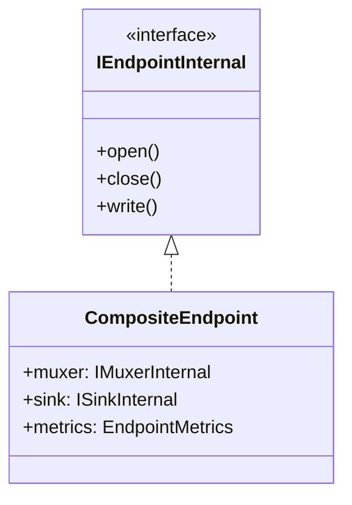

# 🧩 Creating Custom Endpoints

To create a new endpoint, implements the `IEndpointInternal` class or directly use the
[`CompositeEndpoint`](https://thibaultbee.github.io/StreamPack/api/streampack-core/io.github.thibaultbee.streampack.core.elements.endpoints.composites/-composite-endpoint/index.html) class.

## Muxers

Muxers implement the `IMuxer` interface.
Muxers are passed in the constructor of the [`CompositeEndpoint`](https://thibaultbee.github.io/StreamPack/api/streampack-core/io.github.thibaultbee.streampack.core.elements.endpoints.composites/-composite-endpoint/index.html).

To create a new muxer, implements the [`IMuxerInternal`](https://thibaultbee.github.io/StreamPack/api/streampack-core/io.github.thibaultbee.streampack.core.elements.endpoints.composites.muxers/-i-muxer-internal/index.html) class.

## Sinks

Sinks implement the [`ISink`](https://thibaultbee.github.io/StreamPack/api/streampack-core/io.github.thibaultbee.streampack.core.elements.endpoints.composites.sinks/-i-sink/index.html) interface.
Sinks are passed in the constructor of the [`CompositeEndpoint`](https://thibaultbee.github.io/StreamPack/api/streampack-core/io.github.thibaultbee.streampack.core.elements.endpoints.composites/-composite-endpoint/index.html).

To create a new sink, implements the `ISinkInternal` class.
