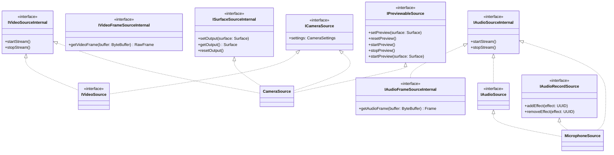

# 🧩 Creating Custom Sources

There are 2 types of sources:

- frames are captured in a `ByteBuffer`: such as a microphone. `ByteBuffer` sources
  implement [`IAudioFrameSourceInternal`](https://thibaultbee.github.io/StreamPack/api/streampack-core/io.github.thibaultbee.streampack.core.elements.sources.audio/-i-audio-frame-source-internal/index.html) (for audio) (such as [`MicrophoneSource`](https://thibaultbee.github.io/StreamPack/api/streampack-core/io.github.thibaultbee.streampack.core.elements.sources.audio.audiorecord/-microphone-source/index.html)) and
  `IVideoFrameSourceInternal` (
  for video) (not available).
- frames are passed to the encoder surface (video only): when the video source can write to
  a `Surface`. Its purpose is to improve encoder performance. For example, it suits camera and
  screen recorder. `Surface` sources implement [`ISurfaceSourceInternal`](https://thibaultbee.github.io/StreamPack/api/streampack-core/io.github.thibaultbee.streampack.core.elements.sources.video/-i-surface-source-internal/index.html) (such as [`CameraSource`](https://thibaultbee.github.io/StreamPack/api/streampack-core/io.github.thibaultbee.streampack.core.elements.sources.video.camera/-camera-source/index.html)).

To create a new audio source, implements `IAudioSourceInternal`(inherits
from `IAudioFrameSource`).

To create a new video source, implements `IVideoSourceInternal` and  [`ISurfaceSourceInternal`](https://thibaultbee.github.io/StreamPack/api/streampack-core/io.github.thibaultbee.streampack.core.elements.sources.video/-i-surface-source-internal/index.html) (or
`IVideoFrameSourceInternal` - not supported). Always prefer to use a video source as a `Surface`
source if it is
possible. `IVideoFrameSourceInternal` is not usable in a streamer.
If the video source is previewable, it must implements [`IPreviewableSource`](https://thibaultbee.github.io/StreamPack/api/streampack-core/io.github.thibaultbee.streampack.core.elements.sources.video/-i-previewable-source/index.html). You can use the
[`AbstractPreviewableSource`](https://thibaultbee.github.io/StreamPack/api/streampack-core/io.github.thibaultbee.streampack.core.elements.sources.video/-abstract-previewable-source/index.html) class to simplify the work.
