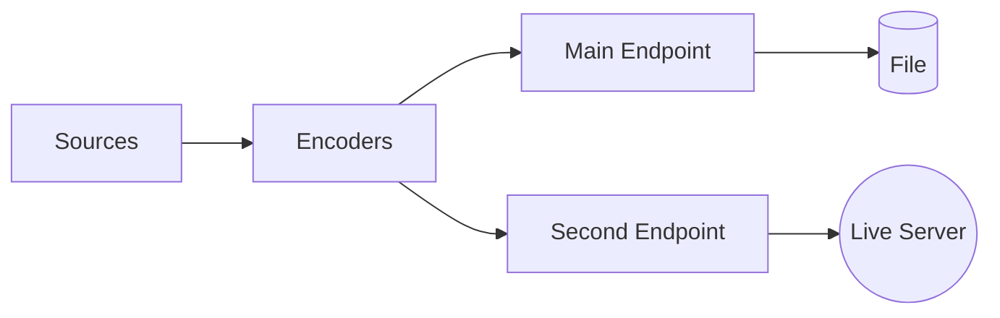
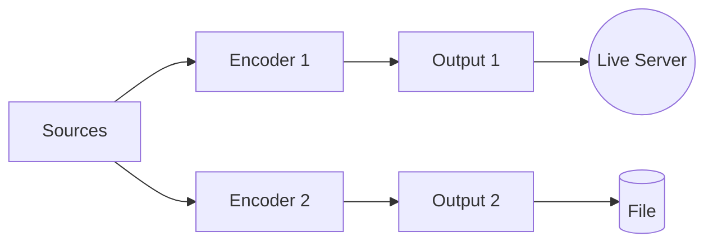

# Live and record simultaneously

Starting from version 3.0.0, you can now live stream and record at the same time. There are 2 ways
to do it:

- With the dual endpoint/single-encoder: [`DualEndpoint`](https://thibaultbee.github.io/StreamPack/api/streampack-core/io.github.thibaultbee.streampack.core.elements.endpoints/-dual-endpoint/index.html)
- With the dual streamer/multi-encoder: [`DualStreamer`](https://thibaultbee.github.io/StreamPack/api/streampack-core/io.github.thibaultbee.streampack.core.streamers.dual/-dual-streamer/index.html)

## Dual endpoint

The [`DualEndpoint`](https://thibaultbee.github.io/StreamPack/api/streampack-core/io.github.thibaultbee.streampack.core.elements.endpoints/-dual-endpoint/index.html) is a [`CombineEndpoint`](https://thibaultbee.github.io/StreamPack/api/streampack-core/io.github.thibaultbee.streampack.core.elements.endpoints/-combine-endpoint/index.html) that streams to 2 endpoints in a single streamer. The idea
is to that the encoded frames are pushed to 2 endpoints: one for the live stream and one for the
recording.

!!! success "Advantage"
    As only 2 encoders (1 for video and 1 for audio) are used, it uses significantly less hardware (CPU/memory) resources.



### Implementation

The [`DualEndpoint`](https://thibaultbee.github.io/StreamPack/api/streampack-core/io.github.thibaultbee.streampack.core.elements.endpoints/-dual-endpoint/index.html) has 2 endpoints: the main endpoint and the second endpoint.
Use the main endpoint for the recording and the second endpoint for the live stream.

You have to call the `open` or `startStream` of the second endpoint by yourself. The main endpoint
is started by the streamer.

```kotlin
val dualEndpointFactory = DualEndpointFactory(
    mainEndpointFactory = MediaMuxerEndpointFactory(),
    secondEndpointFactory = SrtEndpointFactory() // SRT package is required for SrtEndpointFactory
)

val streamer = SingleStreamer(
    context,
    endpointFactory = dualEndpointFactory
)
```

You have to open all the endpoints before calling `startStream` on the streamer:

```kotlin
streamer.open("rtmp/serverip:1935/s/streamKey") // open the main endpoint
val endpoint = streamer.endpoint as DualEndpoint
endpoint.openSecond("file:///path.to.file.mp4") // open the second endpoint
streamer.startStream() // start the streamer and the first endpoint
endpoint.startStreamSecond() // start the second endpoint
```

## Dual streamer

The [`DualStreamer`](https://thibaultbee.github.io/StreamPack/api/streampack-core/io.github.thibaultbee.streampack.core.streamers.dual/-dual-streamer/index.html) is a `Streamer` that streams to 2 independent outputs.

!!! success "Advantage"
    Because the two outputs are independent, you can use completely different settings for each output (e.g., different codecs, bitrates, resolutions).



### Implementation

Use a [`DualStreamer`](https://thibaultbee.github.io/StreamPack/api/streampack-core/io.github.thibaultbee.streampack.core.streamers.dual/-dual-streamer/index.html):

```kotlin
val streamer = DualStreamer(context)

// To start the live stream on the first output
streamer.first.startStream("rtmp://serverip:1935/s/streamKey")
// To start the recording on the second output
streamer.second.startStream("file:///path.to.file.mp4")
```